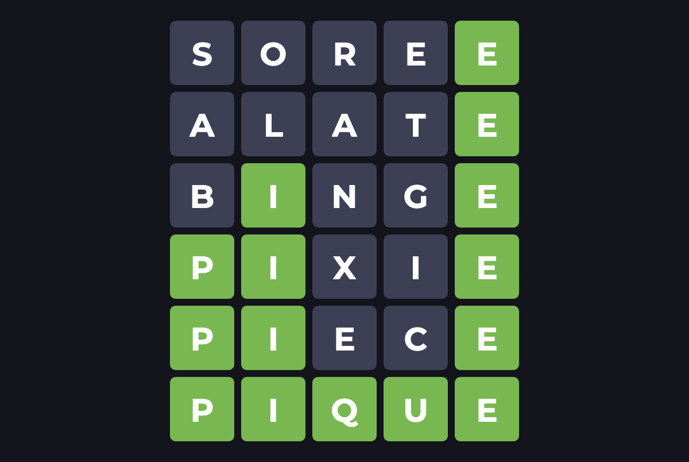

# Wordle Solver

Solves the Wordle game interactively or optionally non-interactively. 

_Wordle_ is a word puzzle in which the player has to guess a five-letter word within six attempts. After each guess, 
the player is given feedback on the letters that are correct and in the correct position, correct but in the wrong 
position, or incorrect.

NYTimes Wordle game: https://www.nytimes.com/games/wordle/index.html

## Installation
`pip install -r requirements.txt`

## Usage

> `src/wordle.py [-h] -d DICT [DICT ...] [-l LEN] [-t TRIES] [-n] [-w WORD] [-c] [-q]`

### Options:
```
  -h, --help                                 Show this help message and exit
  -d DICT [DICT ...], --dict DICT [DICT ...] Dictionary files
  -l LEN, --len LEN                          Word length (default: 5)
  -t TRIES, --tries TRIES                    Maximum tries (default: 6)
  -n, --non-interactive                      Turn on non-interactive mode by providing the word to guess
  -w WORD, --word WORD                       The word to solve in non-interactive mode
  -c, --continuous                           Continuous mode; uses all words in the dictionary
  -q, --quiet                                Quiet mode
```

## Example

```
❯ dist/wordle -d wordle_words.txt -n -w sorry
Round: 1
Current possible answers: 2309
Best guesses:
        - slate: (0.62)
        - sauce: (0.61)
        - slice: (0.61)
        - shale: (0.61)
        - saute: (0.60)
Guess: slate
Response: █████

Round: 2
Current possible answers: 56
Best guesses:
        - sorry: (0.57)
        - shiny: (0.57)
        - spiny: (0.54)
        - sunny: (0.53)
        - spicy: (0.52)
Guess: sorry
Response: █████
Wordle solved in 2 tries
```

## CI Status
[](https://github.com/arunkv/wordle/actions/workflows/codeql.yml) [](https://github.com/arunkv/wordle/actions/workflows/pylint.yml) [](https://github.com/arunkv/wordle/actions/workflows/qodana_code_quality.yml)

## License

Apache License 2.0
